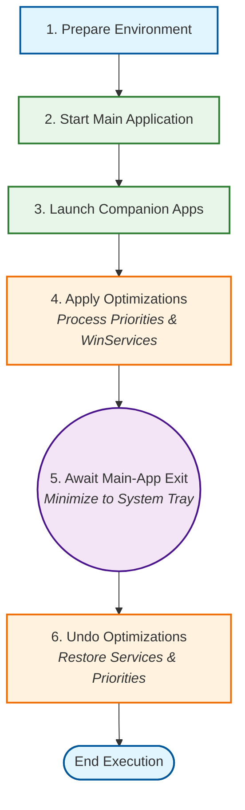

<p align="center">
  
</p>

<h1 align="center">Posh-Playbook-Launcher</h1>

<p align="center">
  A lightweight, JSON-driven application launcher and Windows environment orchestrator focused on Windows performance configurations, powered by PowerShell 7.
</p>

---

## ✨ Features
- Start a Executable with companion applications
- Stops windows services
- Adjusts process priorities
- Disables CPU-Cores parking [**WIP**]

## 📝 Requirements
- Windows
- PowerShell 7+
- Git-CLI

## 🔎 How it Works



## 📌 Instructions

**0. Open a PowerShell.**

**1. Download project**
```powershell
$repoRoot      = "$($env:UserProfile)/.my-scripts"
$repoName      = "posh-playbook-launch"
$repoDirectory = Join-Path $repoRoot $repoName
$repoUrl       = "https://github.com/JanGaida/posh-playbook-launch.git"

# Create root directory if it does not exist
if (-not (Test-Path -Path $repoRoot)) {
    New-Item -Path $repoRoot -ItemType Directory | Out-Null
}

# Clone repository only if it does not already exist
if (-not (Test-Path -Path $repoDirectory)) {
    git clone $repoUrl $repoDirectory
}
else {
    Write-Host "Repository already exists at: $repoDirectory"
}

Set-Location $repoDirectory
```

**2. Create and edit a new playbook**
```powershell
$myNewPlaybook = "my-playbook-name"

./playbook-tools.ps1 `
    -Action "Create-New" `
    -Playbook $myNewPlaybook

code "./playbooks/$myNewPlaybook"
```

**3. Create shortcut and launch**
```powershell
$runPlaybook = "my-playbook-name"

./playbook-tools.ps1 `
    -Action "Create-Shortcut" `
    -Playbook $runPlaybook
```

**4. Launch a playbook**
##### *Via Cli*
```powershell
./playbook-launch.ps1 `
    -Playbook $runPlaybook
```

##### *Via Desktop Shortcut*
Run the generated shortcut from your desktop.

## 🛠️ Parameters: 

### playbook-launch.ps1

```powershell
./playbook-launch.ps1 `
    -Playbook <PLAYBOOK> `
    -PlaybookDir <PLAYBOOK_DIR> `
    -Log `
    -Verbose
```
| Name | Type | Mandatory | Default | Description |
|-:|-|-|-|:-|
| **Playbook** | string | Yes | | The playbook ID to launch |
| **PlaybookDir** | string | No | playbooks | The playbook directory to use|
| **Log** | Switch | No | false | Enables logging*¹* |
| **Verbose** | Switch | No | false | Enables verbose logs |

*¹Note: More logging options can be configured in the playbook-json itself.*

### playbook-tools.ps1

```powershell
./playbook-tools `
    -Action <ACTION> `
    -Playbook <PLAYBOOK> `
    -PlaybookDir <PLAYBOOK_DIR> `
    -Destination <DESTINATION> `
    -Shell <SHELL>
```
| Name | Type | Mandatory | Default | Description |
|-:|-|-|-|:-|
| **Action** | "Create-New", "Create-Shortcut" | Yes | | The action to execute |
| **Playbook** | string | Yes | | The target playbook ID |
| **PlaybookDir** | string | No | playbooks | The playbook directory to use |
| **Destination** | fullpath | No | "$env:UserProfile/Desktop" | Destination path of the generated shortcut|
| **Shell** | exec | No | "pwsh.exe" | Shell executable used to launch the playbook*²* |

*² Note: Script Requires PowerShell v7+*

---

### 🤖 Dev-Resources:

| Name | Url |
|-:|-|
| Powershell Approved Verbs (v7.6) | [microsoft.com/../approved-verbs-for-windows-powershell-commands](https://learn.microsoft.com/en-us/powershell/scripting/developer/cmdlet/approved-verbs-for-windows-powershell-commands?view=powershell-7.6#lifecycle-verbs) |

### 🏷️ Version

##### Convention:
```shell
# Set new Version
git tag -a v1.0 -m "Release 1.0"

# Read Version
git describe --tags
```

| Version | Date |Changes |
|-:|-|-|
| v0.1 | 05.2026| Init |
